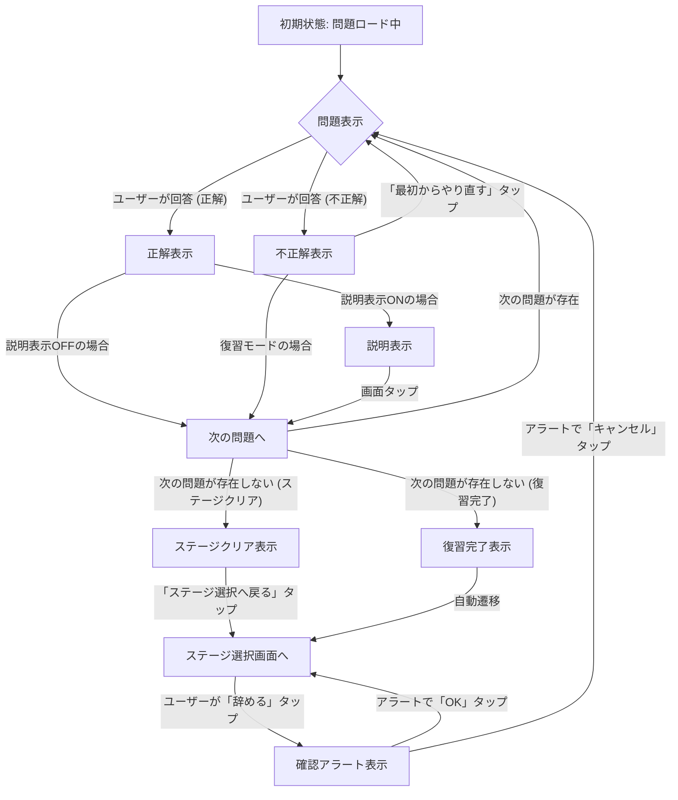

# 鬼単 (OniTan)

鬼単は、漢字検定準1級レベルの漢字学習をサポートするために設計された、シンプルなクイズアプリケーションです。

## 主な機能

- **ステージ制クイズ**: 複数のステージに分かれた漢字クイズに挑戦できます。
- **ステージの自動検出**: `stageX.json`形式のJSONファイルを追加するだけで、新しいステージが自動的にアプリに認識されます。
- **緊張感のあるルール**: 1問でも間違えるとステージの最初からやり直しとなる、集中力が試されるゲームデザインです。
- **進捗の自動保存**: クリアしたステージは自動的に保存され、いつでも続きから再開できます。
- **テーマ設定**: ライトモード、ダークモード、システム設定に加え、5種類のテーマカラー（クラシック、ナチュラル、パッション、エレガント、サンシャイン）から選べます。
- **進捗リセット**: 設定画面からすべての学習記録をリセットし、最初からやり直すことができます。
- **効果音と触覚フィードバック**: 正解・不正解時に効果音と触覚フィードバックが提供され、設定でON/OFFを切り替えられます。
- **ブックマーク機能**: クイズ中に気になった問題をブックマークし、復習モードで重点的に学習できます。
- **復習モード**: 間違えた問題とブックマークした問題が自動的にリストアップされ、後から集中的に復習できます。
- **問題シャッフル機能**: 設定から問題と選択肢の表示順をシャッフルする機能を有効にできます。
- **漢字フォントの変更**: 表示される漢字のフォントを、システム標準、ヒラギノ角ゴ、游ゴシック、明朝体から選択できます。
- **進行度の表示**: 通常のステージでは、現在のステージの総問題数と、それに到達するまでの正解数を表示します。
- **柔軟な復習体験**: 復習モードでは、間違えた問題をリストから削除しながら効率的に学習を進めることができます。

## 技術スタック

- **言語**: Swift
- **フレームワーク**: SwiftUI
- **IDE**: Xcode

## データ構造

クイズの問題はJSONファイルで管理されています。各問題は以下のSwiftの`Question`構造体に対応しています。

```swift
struct Question: Identifiable, Codable {
    let id = UUID()
    let kanji: String
    var choices: [Choice] // Choiceはtext: Stringを持つ構造体
    let answer: String
    let explain: String
}
```

## 実行方法

1.  このリポジトリをクローンします。
2.  `OniTan.xcodeproj` ファイルをXcodeで開きます。
3.  シミュレータまたは実機を選択して、ビルド・実行します。
4.  **効果音について**: 効果音を再生するには、`Quiz-Ding_Dong.mp3`（正解音）と`Quiz-Buzzer.mp3`（不正解音）のファイルをXcodeプロジェクトのメインバンドルに追加する必要があります。

## アプリケーション設計

### データフロー図 (Data Flow Diagram)

OniTanアプリの主要なデータフローは以下のようになります。

```
+-------------------+       +-------------------+       +-------------------+
|       View        |       |     ViewModel     |       |       Model       |
| (HomeView,        |       | (MainViewModel,   |       | (Question, Stage) |
| StageSelectView,  |<----->| AppState,         |<----->|                   |
| MainView,         |       | ProgressStore)    |       |                   |
| SettingsView)     |       |                   |       |                   |
+-------------------+       +-------------------+       +-------------------+
         ^                           ^       ^
         |                           |       |
         |                           |       |
         |                           v       v
         |                   +-------------------+
         |                   |  QuizDataLoader   |
         |                   | (JSON Files)      |
         |                   +-------------------+
         |                           ^
         |                           |
         |                           |
         |                   +-------------------+
         |                   | SoundManager      |
         |                   | HapticsManager    |
         +-------------------+-------------------+
```

**主要なデータの流れ:**

1.  **初期データロード**: `OniTanApp`起動時に`QuizDataLoader`がJSONファイルから`QuizData`（`Stage`と`Question`の集合）を読み込み、環境変数としてアプリ全体に提供します。
2.  **UI表示**: `View`（例: `StageSelectView`, `MainView`）は、`ViewModel`（`AppState`, `ProgressStore`）から表示に必要なデータを取得します。
3.  **ユーザーインタラクション**: ユーザーが`View`を操作すると、イベントが`ViewModel`に伝達されます。
4.  **ロジック処理**: `ViewModel`はイベントを受け取り、ビジネスロジック（例: 回答判定、ステージクリア判定、進捗保存）を実行します。
5.  **状態更新**: `ViewModel`は`@Published`プロパティを通じて`AppState`や`ProgressStore`の状態を更新します。`ProgressStore`は`UserDefaults`と連携し、永続化を行います。
6.  **フィードバック**: `ViewModel`は`SoundManager`や`HapticsManager`を呼び出し、ユーザーに音や触覚フィードバックを提供します。
7.  **UI更新**: `ViewModel`の状態変更は`View`に通知され、`View`は自動的に再描画されます。

### 状態遷移図 (State Transition Diagram) - `MainViewModel`の例

`MainViewModel`はクイズの進行を管理し、主に以下の状態と遷移を持ちます。



**状態の説明:**

*   **初期状態: 問題ロード中**: アプリがステージの問題を読み込んでいる状態。
*   **問題表示**: 現在のクイズ問題と選択肢が表示されている状態。
*   **正解表示**: ユーザーの回答が正解だった場合に表示される状態。
*   **不正解表示**: ユーザーの回答が不正解だった場合に表示される状態。
*   **説明表示**: 正解後に問題の解説が表示される状態（設定による）。
*   **次の問題へ**: 次の問題への遷移を準備する中間状態。
*   **ステージクリア表示**: 通常モードで全問正解し、ステージをクリアした場合に表示される状態。
*   **復習完了表示**: 復習モードで全ての復習問題を消化した場合に表示される状態。
*   **ステージ選択画面へ**: クイズ画面からステージ選択画面に戻る状態。
*   **確認アラート表示**: 途中でクイズを終了しようとした際に表示される確認アラートの状態。

この図は、`MainViewModel`がどのようにクイズのフローを制御し、ユーザーの操作や内部ロジックに基づいて状態を遷移させるかを示しています。

## テスト計画 (Test Plan)

今回のリファクタリングで導入された変更点や、既存機能の安定性を確認するためのテスト計画です。

### 軽量テストプラン（今回のリファクタリング用）

*   **1. データ読み込み系**
    *   起動時にすべての `stageX.json` が正しく読み込まれる
        *   ファイルが増えても自動で反映されるか確認
    *   `unused_questions.json` も正しく読み込まれる

*   **2. 進行状況管理（ProgressStore）**
    *   ステージクリア状態が正しく記録・復元される
        *   ステージクリア → 再起動後も保持されるか
    *   間違えた問題・ブックマークが正しく保存・復元される
        *   データ追加・削除がUserDefaultsに反映されているか
    *   `debounce`によるUserDefaults書き込みが遅延しても破綻しない

*   **3. クイズ機能（MainViewModel）**
    *   通常モードでの問題進行が正しく行われる
        *   正答/誤答でカウントが増減し、最後まで進めるか
    *   復習モードで正答した問題が即座に削除される
        *   全問正答で自動的にホームに戻るか
    *   UIがViewModelの状態変更を即時反映する

*   **4. 音・触覚フィードバック**
    *   正答・誤答時の効果音が正しく鳴る（ミュート設定時は鳴らない）
    *   触覚フィードバックが正しく動作する

*   **5. UI全般**
    *   HomeViewの未復習問題バッジが正しく表示される
    *   StageSelectViewのロック状態が正しく反映される
    *   設定画面でテーマ・フォント変更が即座に反映される

### 追加の自動テスト候補（余裕があれば）

*   ProgressStoreの保存/復元の単体テスト
*   MainViewModelの回答判定ロジックの単体テスト（Mock使用）
*   QuizDataロード処理のJSONフォーマット異常時のエラーハンドリングテスト
